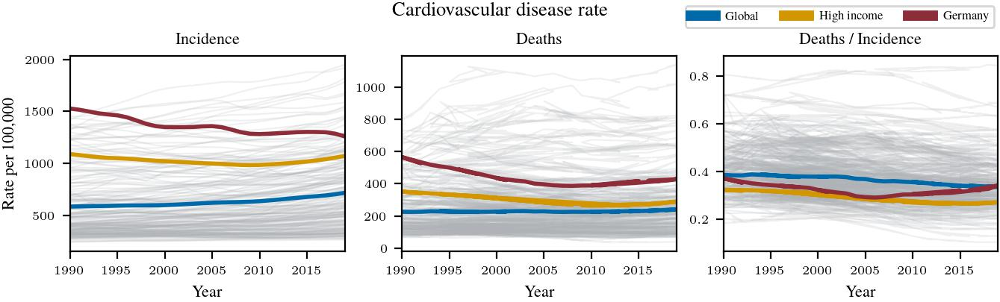
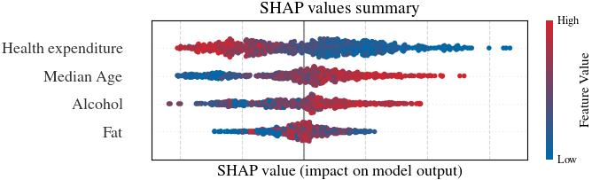

<!--
## Docstrings
"""
This is an example of Google style.

Args:
    param1: This is the first param.
    param2: This is a second param.

Returns:
    This is a description of what is returned.

Raises:
    KeyError: Raises an exception.
"""

https://docs.google.com/document/d/1u-LVvFSsDFmDl7H6Y-cFUUbPc1N2QNrFJSKC9aFDCZs/edit -->

---

<div align="center">    
 
# Heart of the Matter: A Deep Dive into Germany's Cardiovascular Diseases 
</div>

<!-- TABLE OF CONTENTS -->
<details open="open">
  <summary>Table of Contents</summary>
  <ol>
    <li><a href="#goal-of-the-project">Goal of the Project</a></li>
    <li><a href="#description">Description</a></li>
    <li><a href="#repository-structure">Repository structure</a></li>
    <li><a href="#how-to-run">How to run </a></li>
    <li><a href="#license">License</a></li>
    <li><a href="#citation">Citation</a></li>
  </ol>
</details>

<!-- <li>
      <a href="#description">Description</a>
      <ul>
        <li><a href="#dependencies">Dependencies</a></li>
        <li><a href="#installation">Installation</a></li>
      </ul>
</li> -->
 
## Goal of the Project
This project aims to analyze Cardio Vascular Diseases (CVDs), one of the most common health concerns in Germany, from 1990 to 2019 and compare them with other developed countries. The focus is on the diseases and their influencing factors like healthcare systems and lifestyle indicators. It specifically examines the prevalence and statistical significance of diseases like ischemic heart disease using a permutation test. The goal is to understand the impact of lifestyle and healthcare on disease incidence in Germany, providing insights into the country's health risks compared to the global context. Both quantitative and qualitative analysis is used to obtain a conclusion on this problem.


## Description
#### Cardio Vascular Diseases over the years (1990-2019)


Figure 1. Cardiovascular diseases in the world over time. From left to right: incidence rate, death rate, and the ratio of death rate to incidence rate. 

#### Types of Cardio Vascular Diseases 


Figure 2. Death rate of different cardiovascular diseases only for
Germany. Ischemic heart disease takes up majority of the deaths.

#### Cardio Vascular Diseases by age group


Figure 3. Average incidence rate of cardiovascular diseases for 10
year age groups. The incidence rate is much higher for older age
groups, but always the highest in Germany.

#### Factor analysis


Figure 4. Factor analysis. From left to right: alcohol consumption, fat consumption, and health expenditure.

#### SHAP Values


Figure 5. Summary of SHAP values for a predictive model of dis-
ease death rate. Each dot’s color represents the feature’s value, and its position represents the impact on the model’s output.

#### Combined analysis of factors


Figure 6. The combined effect of healthcare spending, alcohol consumption, and median age on the death rate of ischemic heart disease. Special emphasis to the comparison between Germany, high income countries, and the world.


## Repository structure
- **constants** (include constants that are used in multiple files)
- **data**
  - **raw** (original downloaded datasets)
  - **final** (processed datasets from data/raw)
- **doc** (LaTeX code for the report)
  - **fig** (code for generating images and those images used in the LaTeX report)
- **exp** (experiments)
- **scripts** (general data preprocessing code)
- **src** (general functions)


## How to run   
First, install dependencies   
```bash
# clone project   
git clone https://github.com/sykoravojtech/IHD_germany_2024/

# install project   
cd IHD_germany_2024
pip install -e .   
pip install -r requirements.txt

# data preprocessing
python scripts/preprocess_data.py

# data profiling (count countries, year range, missing values)
python scripts/profile_data.py

# make plots
# Fig 1
python doc/IHD_germany_2024/fig/fig_cardiovascular_disease_rate.py

# Fig 2
python doc/IHD_germany_2024/fig/fig_ImpactOfDifferentCVDs.py

# Fig 3
python doc/IHD_germany_2024/fig/fig_cardiovascular_disease_agerange.py

# Fig 4
python doc/IHD_germany_2024/fig/fig_ischemic_rate.py

# Fig 5
python doc/IHD_germany_2024/fig/fig_shap_values_summary.py

# Fig 6
python doc/IHD_germany_2024/fig/fig_bubble_plot_factors.py

```

## License
Distributed under the MIT License. See `LICENSE` for more information.


### Citation   
```
@article{IHD_germany_2024,
  title={Health Concerns in Germany},
  author={Vojtěch Sýkora, Denis Kovačević, Nam Nguyen},
  year={2024}
}
```   